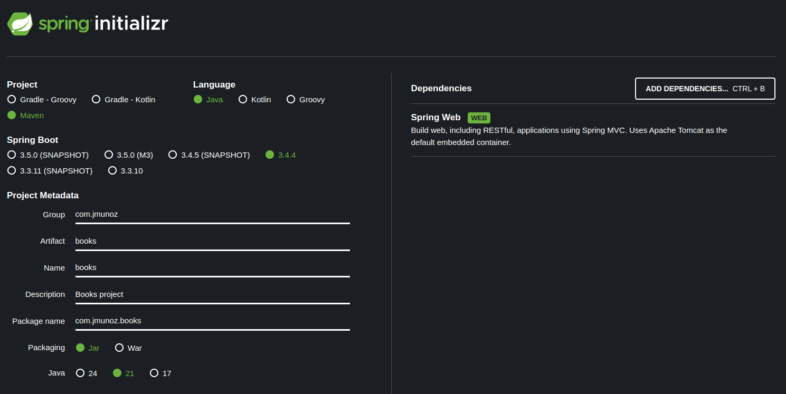
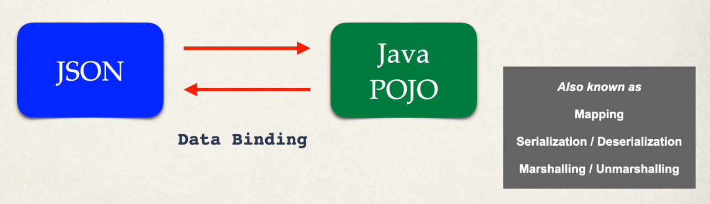
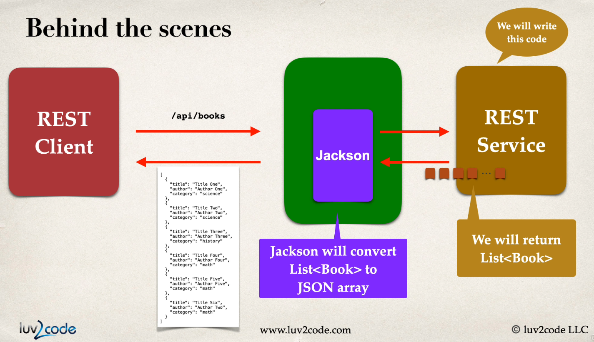
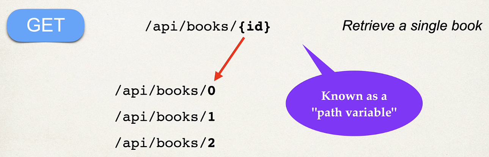
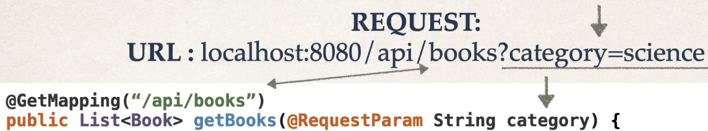
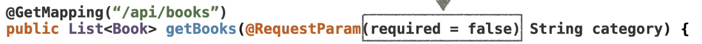
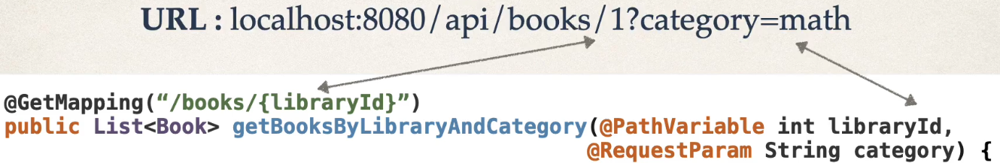
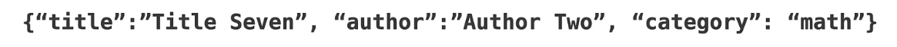
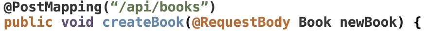
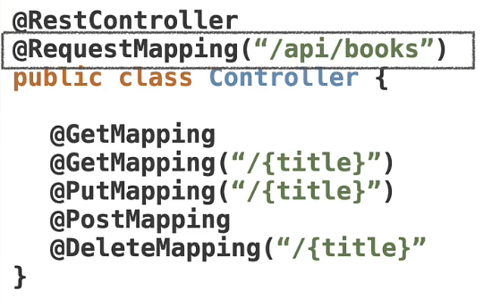

# Books

Creamos el proyecto usando Spring Initializr.



Objetivo:

- Aprender lo básico de Spring Boot Rest
- Vamos a usar una lista (no hay BD) con títulos de libros
- Vamos a crear operaciones CRUD, es decir, vamos a crear libros, leer todos o algún título específico, actualizar libros y borrar los libros
- Cada una de estas operaciones CRUD trata con peticiones (requests) y respuestas (responses)
- Vamos a trabajar con Swagger para probar los distintos endpoints de la API

## Crear el primer endpoint REST

Vamos a crear un endpoint GET.

Creamos un nuevo package llamado `controller` y dentro un archivo `BookController.java`.

## Crear entidades, data binding y segundo endpoint REST

Vamos a usar JSON cuando hagamos peticiones de entidades `book` de nuestro proyecto.

**Java JSON data binding**

Data binding es el proceso de convertir data JSON en un POJO Java para usarlo en nuestra app Java.

Cuando devolvamos data al cliente, necesitamos transformar ese POJO Java en un JSON.

Data binding también es conocido como mapping, serialization/deserialization, marshalling/unmarshalling.



El proceso de data binding ocurre en Spring Boot 3 gracias a `Jackson Project`. Spring Boot maneja automáticamente la integración de Jackson.

Jackson se ejecuta automáticamente y maneja data binding entre JSON y Java POJOs y al revés.

Jackson por defecto llamará al método getter/setter apropiado de la entity.

Es decir, para convertir JSON a un Java POJO, Jackson llamará a los métodos setter del POJO. No tiene acceso a campos privados directamente.

Y, para convertir de un Java POJO a un JSON, Jackson llamará a los métodos getter del POJO. Todo esto, de forma automática.

Por tanto, cuando creemos una entity en Java, tenemos que crear los getter y los setter, aunque no los usemos. Jackson sí los usa.

**Implementando un nuevo service en nuestra aplicación**

Vamos a crear un nuevo servicio que devuelva una lista de books.

Esto es un nuevo endpoint GET al path `/api/books`.

Los pasos son:

- `Book` es nuestro POJO (nuestra Entity)
  - Necesitamos incluir los métodos getter y setter
- Crearemos un nuevo endpoint GET en nuestro servicio REST `BookController` que devolverá `List<Book>`
- Jackson convierte automáticamente `List<Book>` a un array JSON que devolverá al usuario



En concreto:

- Creamos un nuevo package llamado `entity` y dentro la entidad `Book.java`
- En `BookController.java` creamos un nuevo endpoint GET
  - Ver método `public List<Book> getBooks()`

## Implementar Swagger

Vamos a configurar Swagger.

Swagger es un conjunto de utilidades y especificaciones para diseñar, construir, documentar y consumir servicios web RESTful.

La implementación Swagger UI nos permite documentar y llamar a nuestros API endpoints directamente desde nuestra aplicación.

**¿Por qué necesitamos Swagger?**

Ahora mismo podemos ejecutar el endpoint y ver el resultado.

Sin embargo, una vez nuestra aplicación se vuelva más compleja, ir directo al endpoint no será una buena solución.

Esto es debido a la seguridad, autenticación, body/headers de la petición HTTP...

Vamos a necesitar Swagger (¡o Postman!) para poder llamar a nuestros endpoints desde un único sitio.

Por tanto, en vez de ejecutar nuestro endpoint, iremos el endpoint Swagger, que es una página HTTP donde podremos llamar a nuestros endpoints.

**Implementando Swagger en nuestra aplicación**

El endpoint de Swagger es: `http://localhost:8080/swagger-ui/index.html`.

Pero esto es difícil de recordar, por lo que vamos a redirigirlo a `/docs`, es decir: `http://localhost:8080/docs`.

Este se hace accediendo a `application.properties` y añadiendo la propiedad:

```
springdoc.swagger-ui.path=/docs
```

Para que Swagger funcione, necesitamos también añadir la siguiente dependencia a `pom.xml`:

```xml
<dependency>
    <groupId>org.springdoc</groupId>
    <artifactId>springdoc-openapi-starter-webmvc-ui</artifactId>
    <version>2.8.6</version>
</dependency>

<dependency>
    <groupId>org.springframework.boot</groupId>
    <artifactId>spring-boot-starter-validation</artifactId>
</dependency>
```

¡Y ya está!

## Path Variables

Path Variables (o Path Parameters) son parámetros de la petición adjuntos a la URL, que suelen usarse como una forma de obtener información basada en el lugar.

Es una data que se pasa al servidor y sirve para identificar un recurso específico o proporcionar contexto adicional en una petición.



Si la parte dinámica de la URL tiene espacios, hay que indicar `%20`, por ejemplo: `URL: localhost:8080/api/books/jump%20ship%20now`.

**Implementando Path Variables en nuestra aplicación**

Cuando un cliente envía una petición a una URL conteniendo un Path Parameter, el servidor Spring Boot extrae el valor de la URL y lo uso en el request handler. 

En concreto:

- En `BookController.java` creamos un nuevo endpoint GET
  - Ver método `public Book getBookByTitle(@PathVariable String title)`
  - Se usa programación imperativa y funcional

## Query/Request Parameters

Query Parameters son parámetros de la petición adjuntos a la URL tras el carácter `?`.

Constan de un par nombre-valor y suelen usarse para filtrar data. Por ejemplo: `localhost:8080/api/books?category=science`.



Podemos hacer que los Query Parameters sean opcionales.



Si tenemos más de un Query Parameter, estos se separan usando el carácter `&`, por ejemplo: `localhost:8080/api/books?title=Title%20&category=science`.

**Implementando Query Parameters en nuestra aplicación**

En Spring Boot, a los Query Parameters se les llama Request Parameters.

- En `BookController.java` creamos un nuevo endpoint GET
  - Ver método `public List<Book> getBooksByCategory(@RequestParam(required=false) String category)`
  - He tenido que comentar el método `public List<Book> getBooks()` porque su URL es la misma
  - Se usa programación imperativa y funcional

## Path & Query Parameters

Usamos Path Parameters:

- Para identificar recursos concretos
- Cuando la posición e identidad es crítica
- Ejemplos:
  - /users/{userId}
  - /orders/{orderId}
  - /products/{productId}/comments

Usamos Query Parameters:

- Para identificar recursos concretos
- Cuando la posición e identidad es crítica
- Ejemplos:
  - /movies?genre=comedy
  - /products?priceMin=10
  - /products?priceMin=10&priceMax=100

Es muy común usar juntos Path y Query Parameters. Por ejemplo: `localhost:8080/api/books/1?category=math`.



## Petición POST

Se usa para crear data.

POST puede tener un body con información adicional que GET no tiene. Body es una forma de pasar información a nuestro API endpoint.

Ejemplo de Body en formato JSON:



Este es el objeto book que grabaremos.

Recordar que Jackson hace la conversión automática de este body en formato JSON a un Java POJO.

**Implementando POST en nuestra aplicación**



- En `BookController.java` creamos un nuevo endpoint POST
  - Ver método `public void createBook(@RequestBody Book newBook)`
  - Se usa programación imperativa y funcional

## Petición PUT

Se usa para actualizar data.

PUT puede tener un body con información adicional que GET no tiene.

En la URL se indica un Path Variable (opcional, pero muy útil) para identificar el item que se quiere actualizar.

**Implementando PUT en nuestra aplicación**


- En `BookController.java` creamos un nuevo endpoint PUT
  - Ver método `public void updateBook(@PathVariable String title, @RequestBody Book updatedBook)`

## Petición DELETE

Se usa para borrar data.

En la URL se indica un Path Variable para identificar el item que se quiere borrar.

**Implementando DELETE en nuestra aplicación**


- En `BookController.java` creamos un nuevo endpoint DELETE
  - Ver método `public void deleteBook(@PathVariable String title)`

## Request Mapping

Hasta ahora, en cada endpoint de nuestra aplicación hemos añadido `/api/books`.

Request Mapping nos permite indicar a nivel de clase un patrón de endpoint, lo que nos permite eliminar esta repetición de nuestros métodos.

**Implementando Request Mapping en nuestra aplicación**



Tal y como muestra la imagen, modificamos nuestra clase `BookController.java` para añadir la anotación `@RequestMapping("/api/books")`, y eliminamos `/api/books` de nuestros endpoints. 

## Testing

Ejecutamos la app usando el comando `mvn spring-boot:run` en la terminal, o desde IntelliJ.

- Swagger
  - Acceder a la ruta: `http://localhost:8080/docs`
  - Aquí puede probarse todo

Si queremos acceder a los endpoints por separado:

- GET simple
  - http://localhost:8080/api/books/hello
    - Devuelve la cadena `Hola José Manuel!`
- GET (comentado. Usar la URL de Query Parameters sin mandar categoría)
  - http://localhost:8080/api/books 
    - Devuelve la lista de books completa 
- Path Variables (o Path Parameters): http://localhost:8080/api/books/title%20one
  - Devuelve la data para ese título
- Query Parameters (o Request Parameters): http://localhost:8080/api/books?category=science
  - Devuelve la lista de books que cumple que su categoría es science 
  - Para que devuelva la lista de books completa: http://localhost:8080/api/books
- POST
  - Probar con Swagger usando este JSON body: `{"title": "Title seven", "author": "Author seven", "category": "science"}`
- PUT
  - Probar con Swagger usando este JSON body: `{"title": "Computer Science", "author": "Eric Roby", "category": "science"}`
  - En title (el path variable) indicar: `title three`
- DELETE
  - Probar con Swagger usando en title (el path variable): `title four`