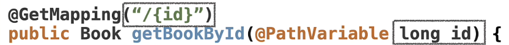
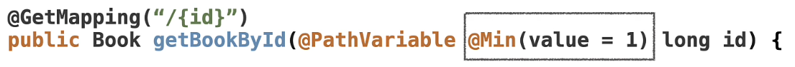
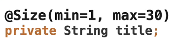
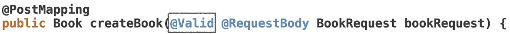
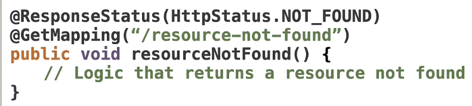
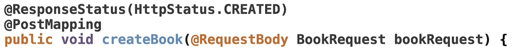
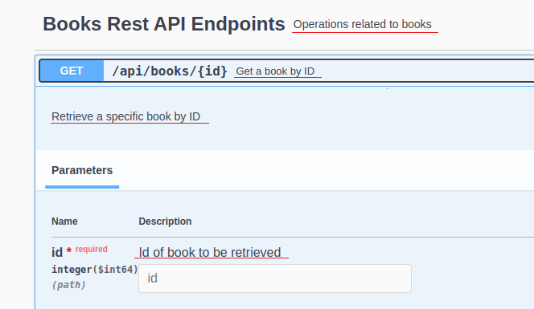
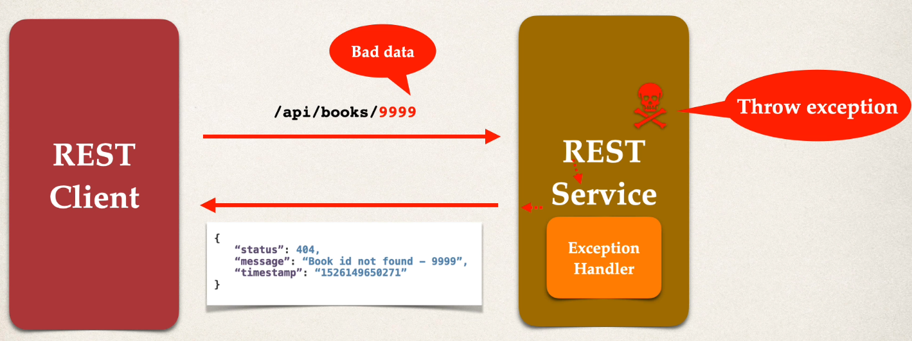
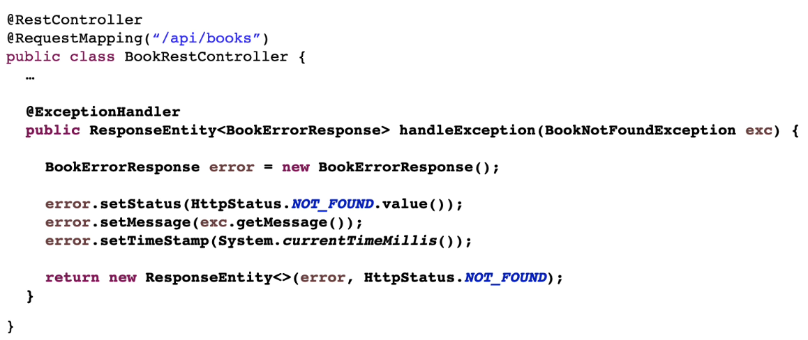
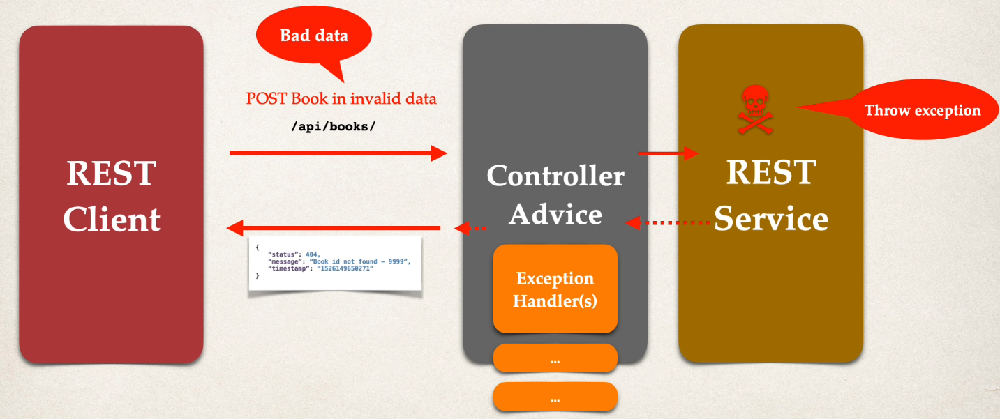

# Books

Creamos un proyecto llamado `02-books`, copiando el proyecto anterior.

Básicamente es lo mismo que el proyecto `01-books`, es decir:

- Seguimos enfocados en crear endpoints API Book
- Creamos otro CRUD

Y añadimos:

- En nuestro entity, los campos de id y de rating
- Validaciones de datos
- Manejo de excepciones
- Códigos de estado
- Configuración de Swagger
- Java Request Objects
- Y, en general, añadimos profundidad a la API REST y lo limpiamos de código innecesario

## Mejorar nuestro Entity

Añadimos dos nuevos campos a `Book.java`:

- id
  - Es un identificador único
- rating

Los añadimos al constructor, y creamos sus getter/setter.

Modificamos `BookController.java`, método `private void initializeBooks()` y añadimos data correcta.

## Mejorar endpoints REST

Vamos a actualizar nuestros API endpoints para que usen el id, que es nuestro identificador único, ya que no habrá dos boos que tengan el mismo id.

Es decir, en vez de pasar como Path Variable un title, ahora pasaremos un id.



Y lo mismo haremos para nuestras peticiones UPDATE y DELETE.

## Objeto DTO BookRequest

Notar que un POST necesita crear un id, no pasarle el id en el body, cosa que se hace ahora mismo, al ser el parámetro esperado de tipo Book.

El problema es que si le pasamos el id, podríamos romper la clave unique.

Para evitar este problema, crearemos un Request Object (no deja de ser un DTO).

- Los Request Objects se crean específicamente para capturar y validar peticiones entrantes HTTP
- Solo contienen la data necesaria para la petición y solo se usan para enviar data al server
- Mejoran la seguridad
- Son flexibles al desacoplar Entity models
- La diferencia con respecto a los objetos Entity es que estos últimos suelen tener más información y tienen una conexión más fuerte con la lógica de negocio

Nuestra clase `Book.java` es un Entity, y lo sabemos porque uno de sus campos es el `id`.

Como hemos dicho, si queremos crear un nuevo book, no hay que pasarle un id. No queremos que el usuario nos diga el id, ya que ese es el identificador único, y no queremos que nos pase uno que ya existe.

Lo que queremos es que nuestro servidor, nuestra aplicación Spring Boot, maneje esos id.

Por tanto, creamos un package `request` (en algunas arquitecturas se llama `dtos`) y dentro la clase `BookRequest.java` con los mismos campos que tiene nuestra clase `Book.java` salvo el campo id, y su cometido es servirle al usuario para que haga una petición de inserción de book a nuestro server.

Modificamos `BookController.java`, método `public void createBook(@RequestBody Book newBook)` a `public void createBook(@RequestBody BookRequest newBook)`, y su contenido.

Creamos también, pensando en la reutilización, un método `private Book convertToBook(long id, BookRequest bookRequest)` para que nos devuelva un book basado en un id obtenido por el server y el body de la petición.

IMPORTANTE: Otra cosa muy poderosa de los DTOs es que podemos añadir validaciones de datos, permitiendo que a nuestra clase `Book` solo llegue data válida, convirtiéndose en nuestra fuente de la verdad. Esto se hará un poco más adelante.

## Mejora en petición PUT

Actualmente, la petición PUT consume la entity Book. Lo vamos a cambiar a BookRequest.

Reutilizaremos el método `convertToBook`.

## Validación de data

Validaciones sobre la data es el proceso que asegura que nuestra data es correcta, completa y respeta nuestras reglas y formatos.

Lo que se hace es comprobar data específica (peticiones de entrada) para validar que cumple las restricciones impuestas.

Por ejemplo: un id no puede ser menor o igual que cero.

La validación es crucial para mantener la integridad de la data, prevenir errores y asegurar que la data es correcta.

Hay tres tipos de validaciones de data:

- Validación de presencia: Asegura que los campos requeridos no están vacíos ni son nulos
- Validación de rango: Asegura que los valores numéricos están dentro de un rango especificado
- Validación de formato: Comprueba si la data sigue el formato especificado (email, número de teléfono...)

**Validaciones a Path Variables y Query Parameters**

El usuario puede pasar cualquier tipo de data como id, como un número negativo, cuando lo que queremos es que siempre sea positivo.

Para solucionarlo, podemos añadir una `cláusula guarda` de esta forma:

```
if (id < 1) {
    return null;
}
```

Pero esto, si hay muchos campos, puede ser muy tedioso.

Hay una manera mucho más fácil de hacer esto usando Spring Boot y Jakarta, y es usando el paquete de validaciones de Jakarta.

Usando este paquete, podemos indicar las validaciones directamente en el método.



Donde, en este ejemplo, indicamos que el valor mínimo del parámetro id es 1. Si esta validación no se cumple, se lanzará un error.

Las validaciones más populares se encuentran en el paquete `jakarta.validation.constraints` y son:

- @NotEmpty: Asegura que el campo no es null o vacío. Puede aplicarse a los tipos String, Collection, Map o Array. Comprueba que el campo tiene, al menos, un elemento o carácter
- @Size: Define una limitación al tamaño del campo. Puede aplicarse a los tipos String, Collection, Map o Array. La anotación permite especificar el tamaño (o longitud) mínimo y máximo permitidos
- @Min: Asegura que el valor numérico del campo es al menos el valor mínimo especificado. Puede aplicarse a tipos numéricos como int, long, float, double...
- @Max: Asegura que el valor numérico del campo no excede el valor máximo especificado. Puede aplicarse a tipos numéricos como int, long, float, double...

**Validaciones sobre Request Objects (DTOs)**

Es necesario añadir validaciones de data en los Request Objects para asegurar la calidad de la data antes de procesarla.

Las validaciones más populares se encuentran en el paquete `jakarta.validation.constraints` y las anotaciones se añaden encima de las propiedades de los objetos. 



Para que estas validaciones se ejecuten, en nuestro controller tenemos que añadir la anotación `@Valid`.



Si no añadimos esta anotación, nuestras validaciones sobre Request Objects no funcionarán.

## Response Status

La anotación `@ResponseStatus` se usa para especificar el código de estado HTTP que debe devolver un método handler o una clase Exception.

Se aplica normalmente en métodos de un controller o directamente en una clase Exception.

Personalización de códigos de estado HTTP:

- Se personaliza el estado de la respuesta HTTP para ciertas condiciones, como al retornar 404 Not Found cuando no se encuentra un recurso o 201 Created cuando un nuevo recurso se crea correctamente

Spring Boot por defecto devuelve 200 en todas las respuestas en las que no hay un error, por ejemplo, al crear data, buscar data, eliminar data...

Pero es bueno ser más explícito y decirle a Spring Boot qué código de estado queremos devolver si todo va bien.

Por ejemplo: 

- 201: Created
- 204: No Content, usado para eliminar data (si no se devuelve nada, que suele ser lo normal)
- etc.

Para esto usamos la anotación `@ResponseStatus`.





## Tags Swagger y Operaciones

- Vamos a añadir más lógica a nuestro Swagger UI para obtener una mejor documentación.
  - @Tag: Para qué se usa el grupo de endpoints
    - Esta anotación se añade al controller
    - 
  - @Operation: Para qué existe un endpoint
    - Esta anotación se añade en cada endpoint
    - 
  - @Parameter: Por qué debe incluirse un parámetro en un endpoint
    - Esta anotación se añade a nivel de parámetro de un método, a la izquierda de un @RequestParam (Query Parameter) p @PathVariable
    -  

Todas estas anotaciones nos permiten autodocumentar el código para futuros desarrolladores. Así queda en Swagger UI:



## Manejo de excepciones

Imaginemos que pasamos como id el valor 9999, ¿qué resultado deberíamos obtener? Ahora mismo obtenemos un valor nulo/vacío.

Esto no es lo que queremos que ocurra. Queremos devolver algo útil, y esto lo conseguimos lanzando la excepción Book Not Found.

Es decir, queremos manejar la excepción y devolver un error en formato JSON:



**Proceso de desarrollo**

- Crear una clase de respuesta de error personalizada
  - Esta clase se devuelve al cliente en formato JSON
  - La definimos como una clase Java (POJO) con los campos que queramos
    - En nuestro ejemplo, la clase se llama `BookErrorResponse.java` y crearemos los campos `status`, `message` y `timestamp`
  - Jackson la convertirá automáticamente a JSON
    - Recordar que nuestra clase tiene que tener getters/setters 
- Crear una clase de excepción personalizada
  - Será usada por nuestro servicio REST
  - En el código, si no encontramos book, lanzaremos la excepción
  - Necesitamos definir una clase de excepción personalizada, llamada `BookNotFoundExcepcion.java`
- Actualizar el servicio REST para lanzar la excepción si no encontramos book
  - Modificaremos `BookController.java` para añadir `.orElseThrow(() -> new BookNotFound("Book id not found - " + bookId));`
- Añadir un método manejador de excepciones usando la anotación @ExceptionHandler
  - Este manejador de excepciones devuelve un `ResponseEntity`, que es un wrapper del objeto de respuesta HTTP
  - ResponseEntity proporciona un control muy fino para especificar
    - HTTP status code, HTTP headers y Response body
    - 

También gestionamos excepciones en nuestros endpoints PUT y DELETE cuando book no existe al igual que hemos hecho con el endpoint GET para obtener un book.

## Manejo de excepción global

Vamos a gestionar excepciones en el endpoint POST, para devolver un JSON personalizado.

Ahora mismo, cuando no se cumple alguna validación de datos, permitimos que Jakarta Validation devuelva al cliente el error que ocurrió.

Este comportamiento es por defecto y es una práctica correcta, pero vamos a mostrar que se puede personalizar cualquier tipo de manejo de excepción que ocurra en nuestra app.

El `parent exception handler` es como se lanzan excepciones en Java y `parent exception` es el objeto principal para gestionar excepciones.

Lo que tenemos que hacer es sobreescribir `parent exception` para que siempre devuelva nuestro `status response` para que no tengamos que preocuparnos por si la gestión de excepciones va a exponer un fallo de nuestra aplicación.

Por tanto, lo que decimos es:

- Si la excepción no es `BookNotFoundException` devuelve una respuesta por defecto para todos los otros tipos de excepción que ocurran en la aplicación. 

## Controller Advice

El código bajo la anotación `@ExceptionHandler` solo sirve para ese controller específico.

No puede reutilizarse en otros controllers, y los proyectos grandes tienen muchos controllers. Tampoco queremos copiar ese código en cada controller.

Para resolver este problema, necesitamos un manejador de excepción global para:

- Promocionar la reusabilidad
- Centralizar la gestión de excepciones

Spring proporciona para resolver este problema la anotación `@ControllerAdvice` que se añade a una clase.

- Es muy similar a un filtro, que es una forma de incerceptar todas las excepciones que pasan por nuestra aplicación
- Podemos pre-procesar peticiones a controllers
- Podemos post-procesar respuestas a manejo de excepciones
- Perfecto para una gestión global de excepciones
- Este es un caso de uso real de AOP



**Proceso de desarrollo**

- Crear una nueva clase `BookExceptionHandler` y la anotamos con la anotación `@ControllerAdvice`
- Refactorizamos nuestro service REST, eliminando el código de manejo de excepción
- Añadimos ese mismo código a nuestro `@ControllerAdvice`

## Testing

Ejecutamos la app usando el comando `mvn spring-boot:run` en la terminal, o desde IntelliJ.

- Swagger
  - Acceder a la ruta: `http://localhost:8080/docs`
  - Aquí puede probarse todo

Si queremos acceder a los endpoints por separado:

- Path Variables (o Path Parameters): http://localhost:8080/api/books/1
  - Devuelve la data para ese id
- Query Parameters (o Request Parameters): http://localhost:8080/api/books?category=science
  - Devuelve la lista de books que cumple que su categoría es science
  - Para que devuelva la lista de books completa: http://localhost:8080/api/books
- POST
  - Probar con Swagger usando este JSON body: `{"title": "Title seven", "author": "Author seven", "category": "science", "rating": 3}`
- PUT
  - Probar con Swagger usando este JSON body: `{"title": "Why 1+1 Rocks", "author": "Adriana", "category": "Math", "rating": 5}`
  - En id (el path variable) indicar: 3
- DELETE
  - Probar con Swagger usando como id (el path variable): 3

Probando Validaciones de data y HTTP Response Status:

- GET /api/books
  - Devolverá el HTTP Response Status 200
- GET /api/books/{id}
  - En Swagger indicar id = -100 y Swagger nos devuelve: For 'id': Value must be greater than 1
  - Si en vez de Swagger usamos Postman, nos devuelve un error 400 Bad Request
  - Devolverá el HTTP Response Status 200 si todo va bien
- PUT /api/books/{id}
  - En Swagger indicar id = -100 y Swagger nos devuelve: For 'id': Value must be greater than 1
  - Si en vez de Swagger usamos Postman, nos devuelve un error 400 Bad Request 
  - Para el body JSON indicar: `{"title": "", "author": "", "category": "s", "rating": 33}` y veremos un status 400 Bad Request
  - Devolverá el HTTP Response Status 204 si todo va bien
- DELETE /api/books/{id}
  - En Swagger indicar id = -100 y Swagger nos devuelve: For 'id': Value must be greater than 1
  - Si en vez de Swagger usamos Postman, nos devuelve un error 400 Bad Request
  - Si se indica un id correcto, como 1, devolverá el HTTP Response Status 204
- POST /api/books
  - Probar con Swagger usando este JSON body: `{"title": "", "author": "", "category": "s", "rating": 33}` y veremos un status 400 Bad Request
  - Devolverá el HTTP Response Status 201 si todo va bien

Probando Excepciones:

- GET /api/books/{id}
- PUT /api/books/{id}
- DELETE /api/books/{id}

En Swagger indicar id = 9999 y nos debe devolver este JSON, que muestra nuestra excepción BookNotFoundException:

```json
{
  "status": 404,
  "message": "Book not found - 9999",
  "timeStamp": 1745348144992
}
```

- POST /api/books
  - Probar con Swagger usando este JSON body: `{"title": "Focus to code", "author": "Chad Darby", "category": "Computer Science", "rating": 6}`

En Swagger nos debe devolver este JSON, que muestra nuestra excepción global personalizada, cuando no es BookNotFoundException:

```json
{
  "status": 400,
  "message": "Invalid request",
  "timeStamp": 1745426243201
}
```