# Employees Parte 2

Creamos un proyecto llamado `03-employees-part2`, copiando el proyecto anterior.

Qué vamos a ver:

- Spring Data JPA en Spring Boot
  - Actualmente, EmployeeDAO usa JPA API, pero Spring Boot tiene su propia implementación de JPA, que es Spring Data JPA
  - Vamos a transformar nuestro proyecto para usar Spring Data JPA en vez de DAO, para que Spring Boot me cree un CRUD básico
- Spring REST API Security
  - Como securizar APIs Spring Boot REST
  - Definir users y roles
  - Proteger URLs basado en role
  - Almacenar users, passwords y roles en BBDD (texto plano y luego encriptado)
  - Vamos a cubrir las tareas más comunes de Spring Security necesarias en el día a día

## Spring Data JPA

El problema con DAO es, ¿qué ocurre si necesitamos crear un DAO para otra entity? Vamos a tener que repetir casi el mismo código, cambiando el tipo de entity y la primary key.

Necesitamos que sea reutilizable o que se cree automáticamente.

Lo que me gustaría es decirle a Spring Boot que creara el DAO por mí, y yo lo único que hago es pasarle el entity y el tipo de dato de la primary key.

Spring Boot crearía automáticamente las características de un CRUD básico.

Esto lo hace `Spring Data JPA`, gracias a que provee la interface `JpaRepository` que expone métodos (algunos heredados de sus padres).

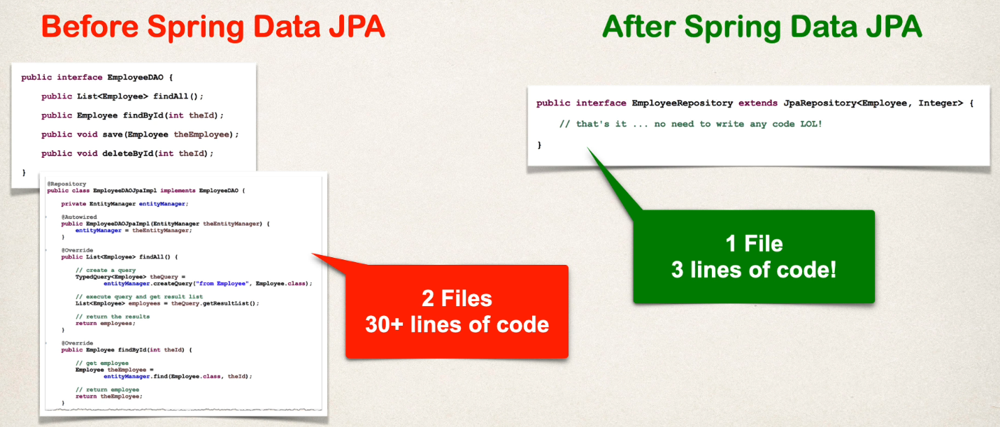

Características avanzadas:

- Podemos extender y añadir queries personalizadas usando `JPQL`
- También permite `Query Domain Specific Language` (Query DSL) 
- Podemos personalizar métodos (código de bajo nivel)

Pero vamos a estar enfocados en las operaciones CRUD básicas.

**Desarrollo**

- Se elimina la interface `EmployeeDAO` y su implementación `EmployeeDAOJpaImpl`
- En el package `dao` creamos la interface `EmployeeRepository` y hacemos que extienda de `JpaRepository<Employee, Long>`
  - Como puede verse, se indica la clase Entity y el tipo de dato de su primary key
  - ¡Y ya está!
- Corregimos `EmployeeServiceImpl` para que tire de nuestro repositorio en vez del Dao que acabamos de borrar

## Spring Security

- Spring Security define un framework para seguridad
- Implementado usando filtros Servlet en segundo plano
- Hay dos métodos para securizar una app: declarativa y programática

**Spring Security con filtros Servlet**

- Servlet Filters se usan para pre-procesar / post-procesar peticiones web
- Servlet Filters pueden enrutar peticiones web basado en lógica de seguridad
- Spring provee una gran cantidad de funcionalidades de seguridad con filtros servlet
- En Spring Security filters, tenemos una configuración que chequea users, password y/o roles

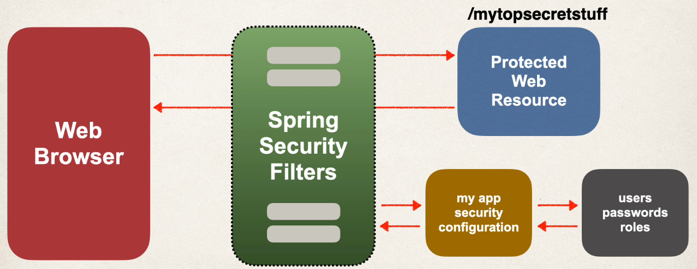

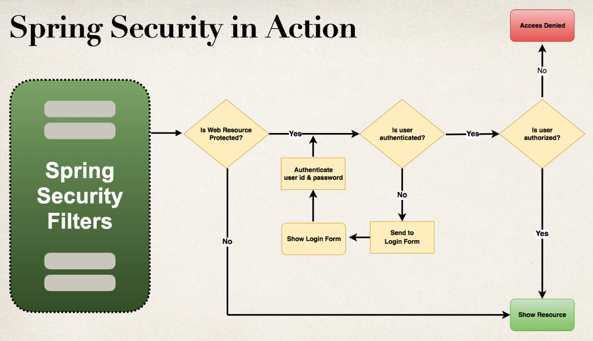

**Conceptos de seguridad**

- Authentication: comprueba user id y password con las credenciales almacenadas en la app/BBDD
- Authorization: comprueba si user tiene un role autorizado

**Seguridad Declarativa**

- Define restricciones de seguridad de la aplicación en un fuente de configuración
  - Es una clase Java anotada con `@Configuration`
- Proporciona separación de responsabilidades entre código de aplicación y seguridad

**Seguridad Programática**

- Spring Security provee una API para codificación de aplicaciones personalizada
- Provee gran personalización para requerimientos de aplicación específicos

**Habilitar Spring Security**

- Editar `pom.xml` y añadir la dependencia siguiente
```xml
<dependency>
  <groupId>org.springframework.boot</groupId>
  <artifactId>spring-boot-starter-security</artifactId>
</dependency>
```
- Una vez añadida la dependencia, automáticamente se securizan todos los endpoints de la aplicación con basic authentication

**Endpoints securizados**

- Ahora, cuando accedamos a la aplicación, Spring Security nos pedirá un login
- Por defecto, username es `user`
- El password cambia en cada ejecución de la aplicación y aparece en la consola

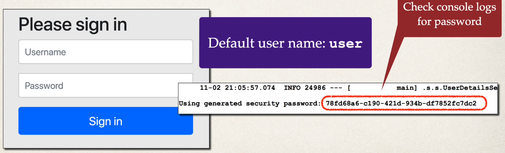

**Configuración de Spring Security**

- Se puede sobreescribir la configuración por defecto de username y la generación automática de password
- En `application.properties` indicar
```
spring.security.user.name=jmunoz
spring.security.user.password=test123
```

**Authentication y Authorization**

- Por tanto, vamos a tener users, password y roles
- Podemos tener todo esto en memoria
- Podemos tener todo en JDBC
- Podemos hacer todo usando LDAP
- Podemos tener Custom / Pluggable
- U otros...

Vamos a centrarnos en esta sección en passwords en BBDD como texto plano y encriptado.

## Configurando Basic Security

Imaginemos estos usuarios/passwords/roles:

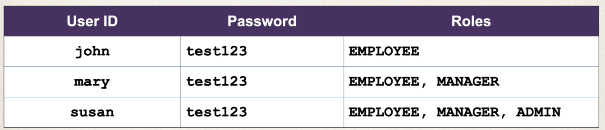

El rol `EMPLOYEE` significa que solo podemos acceder a ciertos aspectos de la API, solo ciertas peticiones son permitidas.

Los otros roles existentes son `MANAGER` y `ADMIN`.

Estos nombres de rol los hemos elegido nosotros. Podemos poner los nombres que queramos a los roles.

Viendo como funciones los roles, son un tipo de lista que almacenan diferentes tipos de rol.

Vamos a comprobar si ese rol existe en la lista para ese user.

**Proceso de Desarrollo**

- Crear la clase de configuración de Spring Security, anotada con `@Configuration`
- Añadir users, passwords y roles
- En Spring Security, los passwords se almacenan usando un formato específico, que es `{id}encodedPassword`, donde id es:
  - `noop` que es password en texto plano
    - Ejemplo: `{noop}test123` donde noop es el algoritmo de codificación y test123 es el password
  - `bcrypt` que es password encriptado

Indicar que no queremos usar password en texto plano, pero comenzamos con ellos para ver como funciona todo antes de encriptarlos.

La forma más común de encriptar un password es usando hashing `bcrypt`.

Hay otros hashing passwords, pero no los vamos a ver.

Vamos a empezar usando lo que se llama `in-memory user details manager` para empezar rápido y ver como funciona la seguridad en Spring Boot.

Luego usaremos BBDD.

Creamos un nuevo package `security` y dentro la clase de configuración `SecurityConfig` que anotaremos con `@Configuration`.

## Spring Security Request Mappers

Vamos a restringir accesos basados en los roles de la siguiente forma:

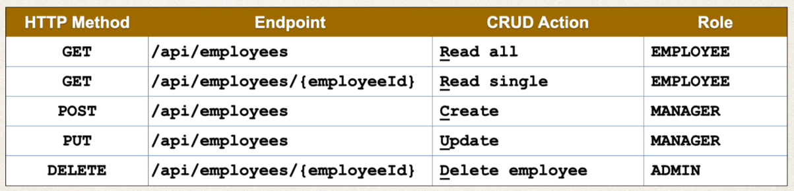

- La sintaxis general es `requestMatchers(<< add path to match on >>).hasRole(<< authorized role >>)`
  - En nuestro caso, el path es `/api/employees`
  - Solo puede indicarse un rol
- Podemos añadir a esta sintaxis el método HTTP seguido del path, es decir `requestMatchers(<< add HTTP METHOD to match on >>, << add path to match on >>).hasRole(<< authorized role >>)`
  - Un ejemplo sería indicar como HTTP METHOD `POST`, y el path `/api/employees` 
  - Solo puede indicarse un rol
- Podemos indicar más de un rol con la sintaxis `requestMatchers(<< add HTTP METHOD to match on >>, << add path to match on >>).hasAnyRole(<< list of authorized roles >>)`
  - Podemos indicar más de un rol, separados por coma

Si en el path indicamos `/api/employees/**`, queremos decir que aplica a todos los sub-paths. Los asteriscos son conocidos como `wildcards`.

**Cross-Site Request Forgery (CSRF)**

- Spring Security puede proteger contra ataques CSRF
- Incrusta data/tokens de autenticación adicional que necesitamos añadir en nuestros formularios HTML
- En subsecuentes peticiones, la app web verificará el token antes de procesar
- El caso principal de uso es para aplicaciones web tradicionales (formularios HTML, etc.)

¿Cuándo usar la protección CSRF? El equipo de Spring Security recomienda:

- Usar la protección CSRF para cualquier petición de navegador web normal
- Apps web tradicionales con formularios HTML que añaden/modifican data

Si estamos construyendo una API REST para clientes que no son navegadores podemos deshabilitar la protección CSRF.

En general, no es requerido para APIs REST sin estado (POST, PUT, DELETE y/o PATCH).

Para nuestro caso, la construcción de una API REST sin estado, deshabilitaremos la protección CSRF.

## Spring Security y Swagger

Vamos a implementar una configuración de Swagger para que pueda usar Basic Authentication dentro de Swagger y no a través de nuestro navegador, que es la manera por defecto de manejar la autenticación.

El principal problema es que la data del login se almacena en el navegador, y hacer logout cuando estamos probando es molesto.

Vamos a hacer Basic Authentication parte de Swagger (porque no lo es) para poder hacer llamadas y testing de nuestros endpoints, deshabilitando las acciones que realiza el navegador.

Para deshabilitar Basic Authentication en el navegador, añadimos la siguiente línea en `SecurityConfig`: 

`http.httpBasic(httpBasicCustomizer -> httpBasicCustomizer.disable());`

Si falla la autenticación, por defecto muestra un pop-up en el navegador para que el usuario haga login.

No queremos que el navegador gestiona nada de esto. Lo tiene que gestionar nuestro endpoint API y Swagger.

Para conseguir esto, seguiremos modificando `SecurityConfig`, añadiendo el método `authenticationEntryPoint()`, y lo mandaremos llamar desde el método `filterChain()` si el usuario no está autorizado.

También vamos a crear un nuevo fichero de configuración `SwaggerConfig` donde Swagger manejará toda la Basic Authentication por nosotros.

## Spring Security con H2

Una vez que implementamos `requestMatchers` ya no podemos acceder a la consola de la BBDD H2. Da el siguiente error: 

```json
{
"error": "Unauthorized access"
}
```

Vamos a configurar la seguridad de H2 para poder volver a acceder a la consola.

En concreto:

- Añadir `requestMatchers` con los paths de nuestra consola de H2
- Añadir un nuevo header para nuestra BBDD H2, para poder eshabilitar `frames`, ya que la consola H2 usa `frames` para operar

## Cuentas de usuario almacenadas en BBDD H2

Por ahora, nuestras cuentas de usuario están codificadas en duro en el código fuente Java.

Vamos a añadir acceso de BBDD a nuestra aplicación.

Estos son nuestros usuarios, con su password y sus roles:


**Acceso a BBDD**

- Spring Security puede leer información de la cuenta de usuario desde BBDD
- Por defecto, se tiene que seguir los esquemas de tablas predefinidos por Spring Security

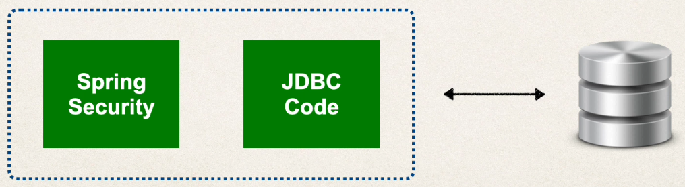

**Personalización de acceso a BBDD con Spring Security**

- Podemos personalizar los esquemas de tablas
- Útil si tenemos tablas personalizadas específicas para nuestro proyecto
- Sin embargo, nosostros seremos los responsables del desarrollo del código de acceso a la data
  - JDBC, JPA/Hibernate, ...

**Proceso de Desarrollo**

Hacemos una copia de `SecurityConfig.java` para no perder la seguridad configurada en memoria. La llamamos `SecurityConfigInMemory.java`.

- Crear Script SQL para configurar la BBDD
- Añadir soporte de BBDD a nuestro fichero POM de Maven
- Crear fichero de propiedades JDBC
- Actualizar la configuración de Spring Security para que use JDBC
  - Eliminamos hardcode 
  - Inyectamos `DataSource` que está autoconfigurado por Spring Boot
  - Devolvemos `JdbcUserDetailsManager(dataSource)` para indicar a Spring Security que use autenticación JDBC con nuestro data source

Nosotros vamos a seguir los esquemas de tablas predefinidos por Spring Security, que son:

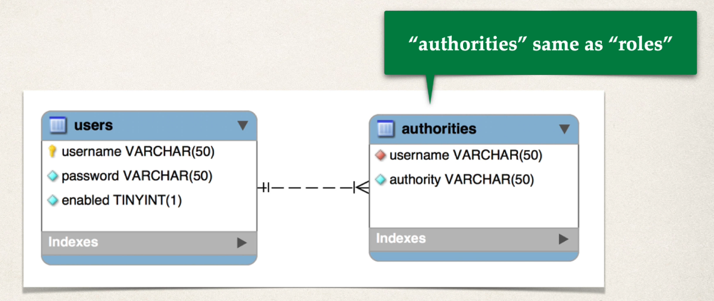

La definición de las tablas puede verse en la carpeta de la raiz `sql`, archivo `1.sql`.

Por ahora, en la tabla `users` almacenamos los passwords como texto plano, usando el encoding `{noop}`.

En la tabla `authorities`, en el campo `authority`, que es el rol, hay que indicar obligatoriamente el prefijo `ROLE_`, por ejemplo `ROLE_MANAGER`.

## Spring Security BCrypt

Nuestros passwords se han almacenado en BBDD en texto plano, y para alguna prueba está bien, pero para producción eso es una muy mala práctica.

Las buenas prácticas indican que los passwords deben almacenarse con algún tipo de encriptación.

Debe verse en BBDD algo parecido a esto, donde se usa encriptación `BCrypt`.

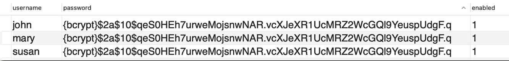

Ver que se indica `{bcrypt}` en vez de `{noop}`.

- Spring Security recomienda usar el popular algoritmo `bcrypt`
- BCrypt
  - Realiza hash de cifrado unidireccional
  - Añade un `salt` aleatorio al password para protección adicional
  - Añade soporte para vencer ataques de fuerza bruta

¿Cómo obtenemos una password BCrypt?

- Opción 1: Usar una utilidad web que realice la encriptación
  - https://www.bcryptcalculator.com/
- Opción 2: Escribir código Java que realice la encriptación

Ahora vamos a usar la opción 1 y más adelante usaremos la opción 2.

**Proceso de Desarrollo**

- Ejecutar el script SQL `sql/2.sql` que contiene los passwords encriptados
  - Tenemos que modificar la DDL del campo password, ya que ahora su tipo debe ser `char(68)`, donde 8 caracteres son para la cadena `{bcrypt}` y 60 caracteres son para el password encriptado
  - Es necesario añadir la cadena `{bcrypt}` porque así es como Spring Security sabe que el password está encriptado con bcrypt

Y ya está, no tenemos que cambiar el código Java. En un proyecto posterior eliminaremos la necesidad de indicar `{bcrypt}` porque haremos que Spring Security maneje todo por código.

**Funcionamiento del Login con BCrypt**

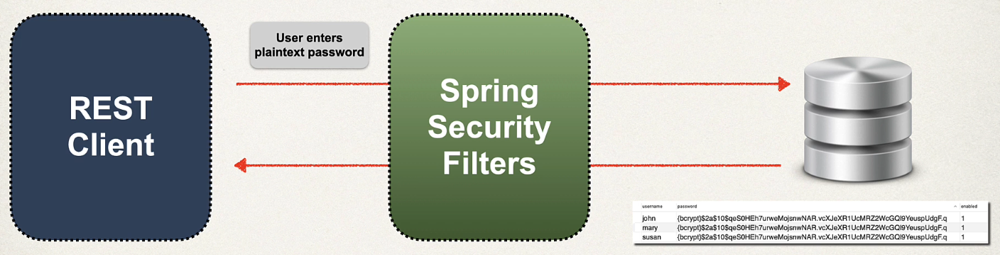

1. Recuperar el password de la BBDD para el user
2. Leer el id del algoritmo de codificación (bcrypt, ...)
3. Para el caso de bcrypt, encriptar el password en texto plano indicado en el formulario de login (usando salt del password de BBDD)
4. Comparar el password encriptado del formulario de login con el password encriptado de la BBDD
   - El password de la BBDD NUNCA se desencripta (no se puede) porque bcrypt es un algoritmo de encriptación unidireccional
5. Si coincide, se realiza el login
6. Si no coincide, no se realiza el login

## Spring Security Tablas Personalizadas

Hasta ahora hemos usado los esquemas de BBDD por defecto para Spring Security (`users` y `authorities`).

Sin embargo, esto es bastante restrictivo, y en nuestra empresa podemos tener tablas con otra convención de nombres y/o campos.

Para poder personalizar los esquemas a nuestro gusto debemos:

- Indicar a Spring como consultar nuestras tablas personalizadas
- Proporcionar una consulta (query) para encontrar el user por nombre de usuario
- Proporcionar una consulta (query) para encontrar authorities/roles por nombre de usuario

**Proceso de Desarrollo**

Hacemos una copia de `SecurityConfig.java` para no perder la seguridad con tablas por defecto. La llamamos `SecurityConfigDefaultTables.java`.

1. Crear nuestras tablas personalizadas con SQL
  - Ejecutar el script SQL `sql/3.sql` que contiene las tablas personalizadas
2. Actualizar la configuración de Spring Security
  - Crear una query para encontrar user por nombre de usuario
  - Crear una query para encontrar authorities/roles por nombre de usuario

Nuestras tablas van a ser las siguientes:

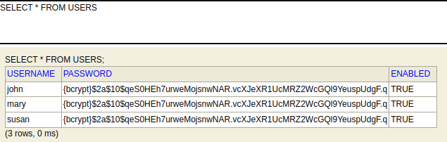

## Testing

Al ejecutar la aplicación por primera vez, si no existe, se crea en la raiz el archivo `/data/employeedb`, que sirve como BBDD persistente.

- Ruta para acceder al gestor de BBDD H2: `http://localhost:8080/h2-console`
- Indicar `jdbc:h2:file:./data/employeedb` como se ve en la siguiente imagen
- El password es `password`
  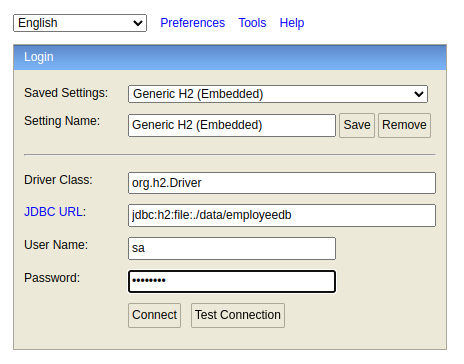
- Pulsar para conectar
- En la carpeta `sql` situada en la raiz del proyecto tenemos el archivo `0.sql`. Lo abrimos, copiamos el contenido y lo pegamos en la consola H2
- Ejecutamos el botón Run
  - Si todo va bien, veremos que se ha creado la tabla `EMPLOYEE` y su data
    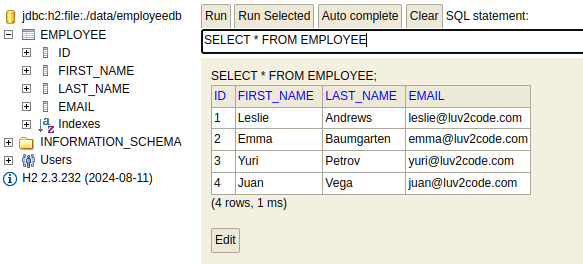
  - Si queremos podemos borrar todos sus elementos y empezar su id desde 1 de nuevo:
  ```sql
  DELETE FROM employee;
  ALTER TABLE employee ALTER COLUMN id RESTART WITH 1;
  ```
  
Ahora tenemos tres opciones, de la que tenemos que elegir de una en una para probar:

- Opción 1: Passwords en texto plano
  - En la carpeta `sql` situada en la raiz del proyecto tenemos el archivo `1.sql` para configurar las tablas de seguridad. Lo abrimos, copiamos el contenido y lo pegamos en la consola H2
  - Ejecutamos el botón Run
  - Si todo va bien, veremos que se han creado las tablas de seguridad, `users` y `authorities`
  
    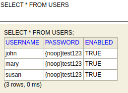
    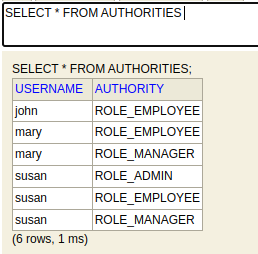
  
- Opción 2: Passwords encriptados con BCrypt y uso de tablas por defecto
  - En la carpeta `sql` situada en la raiz del proyecto tenemos el archivo `2.sql` para configurar las tablas de seguridad. Lo abrimos, copiamos el contenido y lo pegamos en la consola H2
  - Ejecutamos el botón Run
  - Si todo va bien, veremos que se han creado las tablas de seguridad, `users` y `authorities`
  
    
    
  
- Opción 3: Passwords encriptados con BCrypt y uso de tablas personalizadas
  - En la carpeta `sql` situada en la raiz del proyecto tenemos el archivo `3.sql` para configurar las tablas de seguridad. Lo abrimos, copiamos el contenido y lo pegamos en la consola H2
  - Ejecutamos el botón Run
  - Si todo va bien, veremos que se han creado las tablas de seguridad, `users` y `authorities`
  
    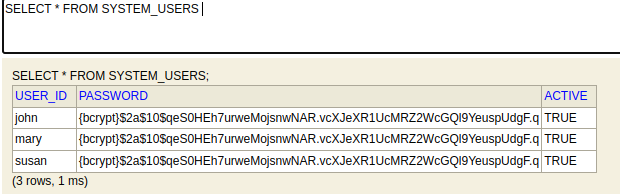
    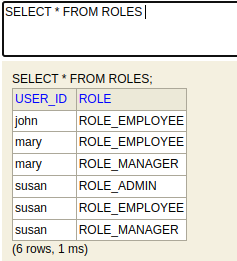

- Opciones uno y dos tenemos que trabajar con `SecurityConfigDefaultTables.java`
  - Descomentamos la anotación `@Configuration` y la comentamos en `SecurityConfig.java`
- Opción tres tenemos que trabajar con `SecurityConfig.java`
  - Descomentamos la anotación `@Configuration` y la comentamos en `SecurityConfigDefaultTables.java`

**Endpoints**

Usando Swagger:

- Acceder a la ruta `http://localhost:8080/docs` y pulsar el botón `Authorize` (también se puede hacer para un endpoint en concreto, pulsando en su icono de candado)
  - username: probar con `john`, `mary` y `susan`
  - password: 
    - Opción 1: para todos los usuarios es `test123`
    - Opciones 2 y 3: para todos los usuarios es `fun123`

- GET all - Lista de todos los employees
  - Tienen acceso todos los usuarios
- GET by Id - Lista de un employee buscando por id
  - Tienen acceso todos los usuarios
  - Indicar id = 1
  - Probar las validaciones indicando id = -4
  - Probar la excepción indicando id = 100
- POST - Creación de un nuevo employee
  - Tienen acceso los usuarios mary y susan
  - Si probamos con otro usuario distinto al de mary o susan, veremos el resultado 403, que indica que no tenemos permiso
  - Indicar este JSON en Swagger
```json
{
  "firstName": "José Manuel",
  "lastName": "Muñoz",
  "email": "jmunoz@mail.com"
}
```
- Nos debe devolver el employee creado, con su id
- PUT - Actualización de un employee
  - Tienen acceso los usuarios mary y susan
  - Si probamos con otro usuario distinto al de mary o susan, veremos el resultado 403, que indica que no tenemos permiso
  - Probar en Swagger indicando el id = 3 y el siguiente JSON
```json
{
  "firstName": "Adriana",
  "lastName": "Guarín",
  "email": "adri@mail.com"
}
```
- Nos debe devolver el employee con la nueva data actualizada
- DELETE - Eliminar un employee
  - Tiene acceso el usuario susan 
  - Probar en Swagger indicando el id = 2
  - Si probamos con otro usuario distinto al de susan, veremos el resultado 403, que indica que no tenemos permiso
  - Si probamos GET all, no debe salir ese employee