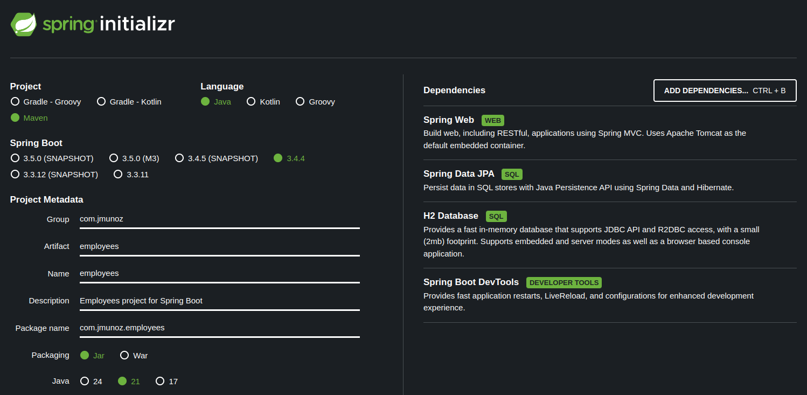
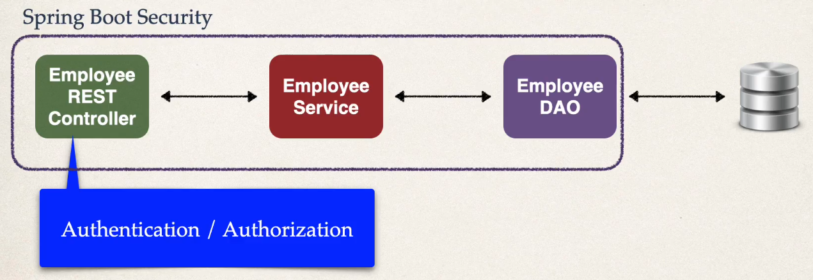
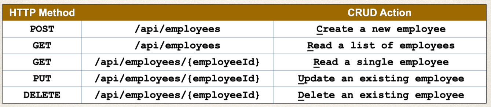
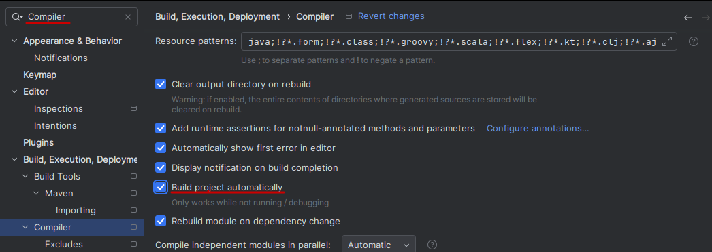
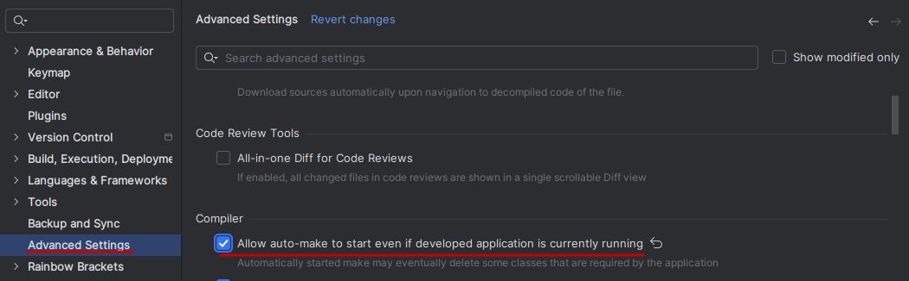
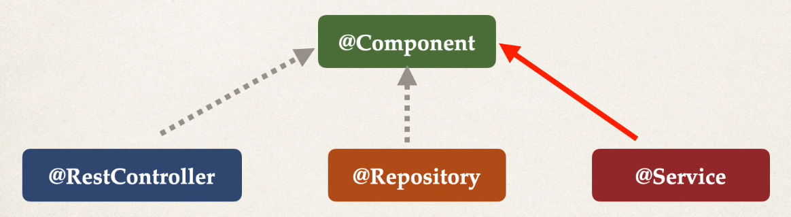
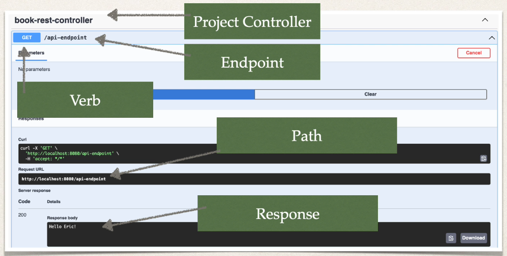
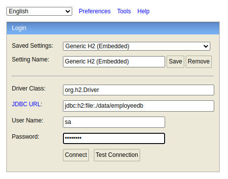
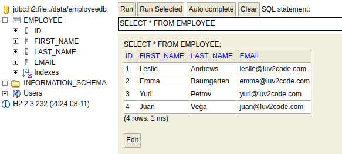

# Employees

Vamos a cambiar el foco de Books a Employees.

Creamos un proyecto llamado `03-employees`.



La nueva información incluye:

- SQL Databases
- Authentication
- Authorization
- Hashing Passwords

La arquitectura es la siguiente:



Donde Spring Boot Security, que es donde vamos a implementar la autenticación y la autorización, va a securizar el Controller, el Service y el DAO.

El controller será nuestro punto de entrada a la autenticación y autorización, es decir, cuando se llame a un endpoint, Spring Boot Security va a interceptar la llamada y va a verificar si el usuario tiene acceso o no.

Los clientes REST que puedan acceder a la API podrán:

- Obtener una lista de Employees
- Obtener un Employee por id
- Crear un Employee
- Actualizar un Employee
- Borrar un Employee



## Configuración de IntelliJ para Auto Reload

Para que las DevTools de Spring Boot funcionen en IntelliJ, tenemos que hacer la siguiente configuración en Settings.





## BBDD H2

Para este proyecto vamos a usar la BBDD H2, que es muy ligera y open-source, escrita en Java.

Suele usarse como BBDD en memoria o fichero.

- En memoria significa en la RAM, mientras se ejecuta el proyecto, y usada normalmente para testing
- En fichero implica una BBDD de fichero persistente que se encuentra en el directorio de nuestro proyecto

En este proyecto vamos a usar H2 como BBDD de fichero, por lo que nuestra data será persistente.

**¿Por qué usamos H2?**

Ya lo tenemos instalado en nuestro fichero POM (lo hicimos al crear el proyecto en Spring Initializr) gracias a esta dependencia

```xml
<dependency>
    <groupId>com.h2database</groupId>
    <artifactId>h2</artifactId>
    <scope>runtime</scope>
</dependency>
```

**¿Cómo usamos la BBDD H2?**

Tenemos que añadir la siguiente configuración al fichero `application.properties`.

```
# Configs
spring.datasource.url=jdbc:h2:file:./data/employeedb
spring.datasource.driverClassName=org.h2.Driver
spring.datasource.username=sa
spring.datasource.password=password
spring.jpa.database-platform=org.hibernate.dialect.H2Dialect

# Console
spring.h2.console.enabled=true
spring.h2.console.path=/h2-console
spring.jpa.hibernate.ddl-auto=update
```

Aquí podemos ver que se creará en la raiz de nuestro proyecto la carpeta `data` y dentro el fichero `employeedb`. Ahí es donde va a vivir nuestra BBDD.

El usuario es `sa` que significa `system admin`.

También configuramos nuestra plataforma de BBDD JPA, indicándole que vamos a usar `Hibernate` y el dialecto `H2Dialect`.

Para acceder a la consola H2, vemos que la URL será `<mi_app>/h2-console`.

Por último, indicamos que, cada vez que ejecutemos la aplicación, vamos a tratar el fichero de BBDD como una BBDD normal y solo la actualizamos cuando se nos fuerza a hacerlo o añadimos una nueva Entity para que cree la tabla automáticamente.

**Desarrollo**

- Tabla employee
  - Vamos a crear la tabla SQL `employee`
  - Vamos a cargar la tabla con datos de prueba (ver directorio `sql` en la raiz del proyecto, archivo `0.sql`)
- Entidad Employee
  - Creamos la entidad `Employee` que coincide con la tabla en BBDD

## Crear Entities

Vamos a crear nuestras clases Entity, que son las clases que coinciden con la tabla de BBDD.

Creamos el package `entity` y dentro la clase `Employee`.

## Interfaz DAO e implementación

Vamos a crear una interfaz DAO y su implementación.

Creamos el package `dao` y dentro creamos la interface `EmployeeDAO` y la clase `EmployeeDAOJpaImpl`.

## Configurar el controller de Employee

Creamos el controller para acceder a nuestro DAO (la data).

Creamos el package `controller` y dentro creamos la clase `EmployeeRestController`.

## Configurar Employee Service

Vamos a definir una capa de servicio con la anotación `@Service` y nuestro controller va a comunicarse con este servicio.

Este servicio va a comunicarse con el DAO, que a su vez se va a comunicar con la BBDD.

El propósito de la capa de servicio es:

- Implementamos el patrón de diseño `Facade`
- Es una capa intermedia con la lógica de negocio personalizada
  - El controller pasa a tener una única responsabilidad, que es consumir la petición HTTP y luego llamar al service correspondiente
- Integra data desde múltiples fuentes (DAO/repositorios) y el service personaliza la respuesta como sea necesaria

La anotación `@Service` es una anotación especializada de `@Component`.



Spring registra automáticamente la implementación del service gracias al escaneo de componentes.

**Desarrollo**

- Definir una interface Service
- Creamos la implementación Service
  - La anotamos con @Service
  - Inyectamos el/los DAOs correspondiente
- Nuestro REST Controller ya no llama al DAO, sino a nuestro service

Creamos el package `service` y dentro creamos la interface `EmployeeService` y su implementación `EmployeeServiceImpl`.

## Actualizaciones a Employee DAO

Añadimos a nuestro DAO los métodos `find`, `add`, `update` y `delete`.

- Las buenas prácticas indican aplicar transaccionalidad en la capa Service
- Es responsabilidad de la capa de servicio gestionar estos límites transaccionales
- Implementación de código
  - Aplicar `@Transactional` en los métodos de servicio
  - Eliminar la anotación `@Transactional` en los métodos DAO si existen

## Actualizaciones a Employee Service

Añadimos a nuestra capa service los métodos `find`, `add`, `update` y `delete`.

Vamos a empezar creando el package `request` y dentro la entity request `EmployeeRequest`.

- Empezamos con una petición que viene del cliente
- La data va a esta nueva entity donde se validan los datos (esto más adelante)
- Parseamos la data desde la entity `EmployeeRequest` a la entity `Employee`
  - Esta conversión es lo primero que se realiza en la capa service

Notar que para los métodos de grabación/actualización/borrado, se indica la anotación `@Transactional`.

## Implementación de Swagger y Validación de data

Vamos a empezar a probar y crear los endpoints API RESTful.

Añadimos las siguientes dependencias a nuestro `pom.xml`:

```xml
<dependency>
    <groupId>org.springdoc</groupId>
    <artifactId>springdoc-openapi-starter-webmvc-ui</artifactId>
    <version>2.3.0</version>
</dependency>

<dependency>
    <groupId>org.springframework.boot</groupId>
    <artifactId>spring-boot-starter-validation</artifactId>
</dependency>
```

Comenzamos añadiendo Swagger a nuestra aplicación.



Por defecto, la ruta es `http://localhost:8080/swagger-ui/index.html` pero la vamos a cambiar en `application.properties` a `http://localhost:8080/docs`. Para ello:

```
springdoc.swagger-ui.path=/docs
```

Por último, añadimos la validación de data en `EmployeeRequest`.

## Mejora del controller

- Añadimos los nuevos endpoints para buscar employee por id, crear, actualizar y eliminar employees
- Añadimos las anotaciones `@Tag` a nivel de clase, `@Operation` a nivel de método para Swagger
- Añadimos la anotación `@ReponseStatus` a los métodos
- Añadimos `@Valid` para crear validaciones cuando se usa `@RequestBody` en los argumentos del método
- Añadimos validaciones `@Min` a `@PathVariable` en los argumentos del método


- Al enviar data JSON a controladores Spring REST, para que el controller pueda procesar esa data en formato JSON necesitamos que el cliente especifique un `HTTP request header`
  - `Content-type: application/json`
  - En Postman tenemos que indicarlo
  - Swagger lo maneja automáticamente

Recordar que la data entra usando `EmployeeRequest` y que delegamos a nuestro servicio el qué hacer.

## Testing

Al ejecutar la aplicación por primera vez, si no existe, se crea en la raiz el archivo `/data/employeedb`, que sirve como BBDD persistente.

- Ruta para acceder al gestor de BBDD H2: `http://localhost:8080/h2-console`
- Indicar `jdbc:h2:file:./data/employeedb` como se ve en la siguiente imagen
- El password es `password`

- Pulsar para conectar
- En la carpeta `sql` situada en la raiz del proyecto tenemos el archivo `0.sql`. Lo abrimos, copiamos el contenido y lo pegamos en la consola H2
- Ejecutamos el botón Run
- Si todo va bien, veremos que se ha creado la tabla `EMPLOYEE` y su data
  

**Endpoints**

Usando Swagger:
- `http://localhost:8080/docs`

- GET all - Lista de todos los employees
  - En el navegador, indicar la ruta: `http://localhost:8080/api/employees`
  - O, mejor, usando Swagger
- GET by Id - Lista de un employee buscando por id
  - En el navegador, indicar la ruta: `http://localhost:8080/api/employees/1`
  - O, mejor, usando Swagger e indicando id = 1
  - Probar las validaciones indicando id = -4 
- POST - Creación de un nuevo employee
  - Indicar este JSON en Swagger
```json
{
  "firstName": "José Manuel",
  "lastName": "Muñoz",
  "email": "jmunoz@mail.com"
}
```
  - Nos debe devolver el employee creado, con su id
- PUT - Actualización de un employee
  - Probar en Swagger indicando el id = 3 y el siguiente JSON
```json
{
  "firstName": "Adriana",
  "lastName": "Guarín",
  "email": "adri@mail.com"
}
```
  - Nos debe devolver el employee con la nueva data actualizada
- DELETE - Eliminar un employee
  - Probar en Swagger indicando el id = 2
  - Si probamos GET all, no debe salir ese employee