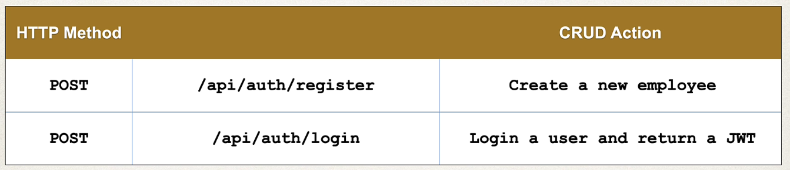

# Todos

Para este proyecto, cambiamos el foco a un proyecto Employee/Admin Todo.

Creamos un proyecto llamado `04-todos`,

La nueva información que vamos a incluir es:

- Tabla de Datos MySQL
- Authentication/Authorization usando JWTs
- Roles de administrador para permisos globales
- Registro de usuarios

La arquitectura es la siguiente:


Los requerimientos son los siguientes:

Crear varios REST APIs para el Directorio Todo:

- Usuarios que pueden pedir su propia información
- Todos que pueden recuperarse, crearse, actualizarse y borrados por su usuario
- Admins que pueden acceder a todos los usuarios, promocionar usuarios a admin y eliminar usuario no admin
- Autenticación para registro y login usando JWTs

Y usando la BBDD MySQL.

Vamos a necesitar:

- Crear entidades y la BBDD MySQL
    - Entity Todo en código
    - Entity User en código
    - Entity Authority en código
    - Mapeos entre cada entity
    - Configurar MySQL
- Crear REST APIs para Authentication/Authorization
    - Instalar las dependencias de JWT
    - Configurar JWTs para nuestro proyecto
    - Crear y añadir configuraciones de seguridad al proyecto
    - Añadir funcionalidad de Authentication Service
    - Añadir funcionalidad de Authentication Controller
    - Los endpoints van a ser
      
- Crear REST APIs para Users
    - Añadir User Request & Response DTOs
    - Añadir funcionalidad User Service
    - Añadir funcionalidad User Controller
    - Los endpoints van a ser
      
- Crear REST APIs para Todos
    - Añadir Todo Request & Response DTOs
    - Añadir funcionalidad Todo Service
    - Añadir funcionalidad Todo Controller
    - Los endpoints van a ser
      
- Crear REST APIs para Admin Roles
    - Añadir Admin roles a la configuración de seguridad
    - Añadir funcionalidad Admin Service
    - Añadir funcionalidad Admin Controller
    - Los endpoints van a ser
      

**Proceso de desarrollo**

1. Crear un proyecto Spring Boot usando Spring Initializr
2. Crear entities
3. Implementar la creación y lectura de JWTs
4. Añadir authentication y authorization al producto
5. Añadir permisos de usuario al producto
6. Añadir Todo al producto
7. Añadir roles Admin al producto

## Creación del proyecto

Creamos el proyecto usando Spring Initializr.


## Creación de Entities

Necesitamos crear el package `entity` y dentro las siguientes entities:

- Todo.java
- User.java
- Authority.java


Cuando se cree la BBDD Spring Boot instanciará y creará estas tablas en la BBDD.

## Configuración de BBDD MySQL

Hay diferentes opciones de configuración:

1. Descargar MySQL en la máquina e instalarlo
2. Usar Docker para hospedar un contenedor ejecutando MySQL

Esta segunda opción es rápida de implementar y podemos eliminar/crear la BBDD de MySQL tantas veces como queramos.

Así que procederemos con la configuración usando Docker.

Una vez creado en container en Docker (yo lo tengo en una Raspberry Pi) añadimos propiedades para conectarnos a la BBDD MySQL.

En `application.properties` hay que añadir:

```
spring.datasource.url=jdbc:mysql://<ip>:<port>/tododb?serverTimezone=UTC&allowPublicKeyRetrieval=true&useSSL=false
spring.datasource.username=<my_user>
spring.datasource.password=<my_password>

spring.jpa.hibernate.ddl-auto=update
spring.jpa.open-in-view=false
```

spring.datasource.url = configura la conexión de BBDD MySQL a nuestra instancia de BBDD local.

spring.datasource.username = establece el username de la BBDD.

spring.datasource.password = establece el password de la BBDD.

spring.jpa.hibernate.ddl.auto = controla como se gestiona el esquema de BBDD. Update significa que automáticamente se actualizará la tabla basada en las entities, pero jamás va a eliminar tablas.

spring.jpa.open=in-view = cierra EntityManager JPA cuando terminan las transacciones. Evita el anti patrón de lazy loading en todos los controladores y vistas. Ayuda al rendimiento.

Para ver la data, me he descargado `SQuirreL SQL` y lo he configurado.

## Implementación Swagger

Instalar OpenAPI para Swagger en `Pom.xml`.

```xml
<dependency>
  <groupId>org.springdoc</groupId>
  <artifactId>springdoc-openapi-starter-webmvc-ui</artifactId>
  <version>2.8.6</version>
</dependency>

<dependency>
    <groupId>org.springframework.boot</groupId>
    <artifactId>spring-boot-starter-validation</artifactId>
</dependency>
```

El path por defecto es: `http://localhost:8080/swagger-ui/index.html`.

Pero como es una ruta complicada, la cambiamos en `application.properties`:

`springdoc.swagger-ui.path=/docs`

Con esto, redirigimos a: `http://localhost:8080/docs`.

## JWT

https://jwt.io/

JWT significa JSON Web Token.

- JWT es una forma autocontenida de securizar transmisiones de data e información entre dos partes usando Objetos JSON
- Puede confiarse en JWT porque cada JWT se firma digitalmente, lo que permite al servidor conocer si el JWT ha cambiado
- JWT debe usarse cuando se trata de authorization
- JWT es una gran forma para intercambiar información entre el servidor y el cliente

**¿Qué es un JSON Web Token?**

Un JSON Web Token está formado de tres partes separadas por punto (.) que incluye:

- Header (rojo)
- Payload (violeta)
- Signature (azul)


**JWT Header**

Normalmente consiste de dos partes:

- El algoritmo para firmar (alg)
- El tipo específico de token (typ)


La JWT Header se codifica usando Base64 para crear la primera parte de JWT.

**JWT Payload**

Son los claims, que son pares key-value que almacenan cualquier información extra que queramos sobre el token, como roles, permisos, user Ids, y la data de la petición o del user.


La JWT Payload se codifica usando Base64 para crear la segunda parte de JWT.

**JWT Signature**

Una JWT Signature se crea usando el algoritmo del header para resolver el header codificado y el payload codificado con un `secret`.

El secret puede ser cualquier cosa, pero se guarda en el server, donde el client no tiene acceso.

El Signature es la tercera parte, y última, de JWT.


Como es un hash, cualquier cambio de data va a romper el secret en el hash. Así sabemos que no es válida.

## Configuración de JWT en nuestro proyecto

1. Instalar JJWT en nuestro proyecto de Spring Boot
2. Crear el servicio JWT
  - Parseo del token para extraer claims y data
  - Validación del token (no ha caducado y es válido)
  - Generación del token para un nuevo usuario autenticado
3. Filtro de autenticación de seguridad JWT
  - Intercepta todas las peticiones HTTP
  - Si el endpoint requiere autenticación, valida el token

**1. Instalar JJWT para JSON Web Token**

En `pom.xml` añadir las siguientes dependencias:

```xml
<dependency>
  <groupId>io.jsonwebtoken</groupId>
  <artifactId>jjwt-api</artifactId>
  <version>0.12.6</version>
</dependency>

<dependency>
  <groupId>io.jsonwebtoken</groupId>
  <artifactId>jjwt-impl</artifactId>
  <version>0.12.6</version>
</dependency>

<dependency>
  <groupId>io.jsonwebtoken</groupId>
  <artifactId>jjwt-jackson</artifactId>
  <version>0.12.6</version>
</dependency>
```

Necesitamos añadir propiedades para JWT en `application.properties`:

```
spring.jwt.secret=<my_secret>
spring.jwt.expiration=900000
```

Recordar que `spring.jwt.secret` sirve para firmar y verificar nuestros JWTs. Se usa para garantizar la integridad y autenticidad de los tokens.

Para generar el secret ejecuto en mi terminal `openssl rand -hex 32`.

Por su parte `spring.jwt.expiration` indica cuando caduca el token tras su creación, y se mide en ms. En el ejemplo 900000ms = 15 minutos.

**2. Crear el servicio JWT**

Creamos el package `service`y dentro crearemos una service interface `JwtService.java` y su implementación `JwtServiceImpl.java` que se encargará de:

- Generación del token
  - Crear JWTs para users autenticados
  - Firmar tokens usando el algoritmo HS256
- Validación del token
  - Verifica si el token es válido o ha caducado
  - Confirma que el token pertenezca al user correcto
- Parseo de token
  - Extrae username, claims y fecha de expiración de ese token específico

**3. Filtro de autenticación de seguridad JWT**

Creamos el package `config` y dentro el fuente `JwtAutenticationFilter`.

- Esencialmente, es un puesto de control de seguridad de nuestra aplicación
- Cada petición se comprueba y si el endpoint requiere autenticación, validamos el JWT adjunto
  - Extraemos las credenciales
  - Verificamos que el token es legítimo y no ha expirado

Nuestro filtro de autenticación JWT se comunica con nuestro servicio JWT, ya que este último ya gestiona mucha de la lógica.

## Security Config y User Repository

Creamos el paquete `repository` y dentro `UserRepository.java`, que es una interface de repositorio de Spring Data JPA para gestionar entidades User.

```java
@Repository
public interface UserRepository extends CrudRepository<User, Long> {
  Optional<User> findByEmail(String email);
}
```

Se usa la anotación `@Repository` para marcar la interface responsable de operaciones de acceso a data.

`CrudRepository` provee operaciones CRUD básicas. `User` es la entidad y `Long` es el tipo de dato de la clave primaria.

La función crea automáticamente una query pra buscar un user por su email.

En el paquete `config` creamos `SecurityConfig.java`, que es la clase para configurar Spring Boot Security.

## Register User

Vamos a realizar todos los pasos para registrar un nuevo user en nuestra aplicación. Los pasos son:

- Crear `RegisterRequest` con validación de data
  - Crearemos también su paquete `request`
- Crear la interface `AuthenticationService` en el paquete `service`
  - Crear `AuthenticationServiceImpl` en el paquete `service`, con la lógica
- Crear `AuthenticationController`, que es el controller que consume los endpoints y llama al service
  - Crearemos también su paquete `controller`
- Modificar `SecurityConfig` para añadir a los requestMatchers un nuevo path permitido, de forma que, para registrar un usuario, no haga falta estar autenticado

## Autenticar un User

Vamos a ver como autenticar un User. El proceso de desarrollo es el siguiente:

- Crear `AuthenticationRequest` con validación de data y `AuthenticationResponse`, que contiene el token JWT de vuelta al usuario para que lo vuelva a añadir en el header en futuras peticiones
  - `AuthenticationRequest` se crea en el paquete `request`
  - `AuthenticationResponse` se crea en el paquete `response` que, como no existe, hay que crear
- Añadir el método `AuthenticationResponse login(AuthenticationRequest request)` a la interface `AuthenticationService`
  - Añadir la implementación del método `AuthenticationResponse login(AuthenticationRequest request)` a `AuthenticationServiceImpl`
- Añadir el endpoint para hacer login a `AuthenticationController`

## Obtener User y Swagger

Además de obtener la información de los usuarios, vamos a configurar las cabeceras de Swagger para consumir cabeceras para nuestras tokens Bearer JWT.

Esto nos permitirá autorizar y pasar esta información de cabecera en nuestros endpoints.

El proceso de desarrollo es:

- Crear la interface `UserService` en el paquete `service`
  - Crear `UserServiceImpl` (lógica de negocio) en el paquete `service`
- Crear `ServiceController` en el paquete `controller` para obtener la información del user
- Configuraciones Swagger para headers y Bearer Tokens
  - Crearemos `SwaggerConfig` en el paquete `config`
  - Hacemos una pequeña modificación en `SecurityConfig`
- Crear `UserResponse` en el paquete `response` con la información que realmente queremos devolver al frontend
  - Evitamos devolver passwords y otra información que no debe tener el frontend

## Eliminar User

El proceso de desarrollo es:

- Modificar la interface `UserService`
  - Modificar su implementación `UserServiceImpl`
- Modificamos `UserRepository` para escribir una query personalizada para encontrar cuantos admins hay en la aplicación 
  - No permitimos que un usuario se borre del sistema si es el último con el rol `ROLE_ADMIN` 
- Modificar `UserController`

## Manejo de Excepciones

Hasta ahora no estamos manejando las excepciones, ya que se devuelve al cliente la excepción que salte, lo que conlleva un riesgo de seguridad.

No queremos dar al cliente más información de la que necesite, por lo que vamos a crear nuestra respuesta de excepción personalizada y nuestros gestores de excepciones.

Lo que queremos es manejar la excepción y devolver un error en formato JSON.

El proceso de desarrollo es:

- Crear el paquete `exception`
- Crear una clase de respuesta de error personalizada que se enviará de vuelta al cliente en formato JSON
  - La clase Java es un POJO con los campos que queremos devolver al cliente, llamada `ExceptionResponses`, en el paquete `exception`
  - Jackson convertirá la clase POJO a JSON
- Crear una clase de excepción personalizada usando @ControllerAdvice, es decir, global a nuestra app
  - @ControllerAdvice es similar a un interceptor/filtro que pre-procesa las peticiones a los controladores y post-procesa las respuestas gestionadas en los manejadores de excepciones
  - Perfecto para gestionar excepciones a nivel global
  - Es un ejemplo de uso real de AOP en Spring
  - Crearemos el fuente `ExceptionHandlers` en el paquete `exception`
- Añadir métodos de gestión de excepciones usando @ExceptionHandler
  - Una para Exception global
  - Una para nuestro ResponseStatusException


## Utilidades

Creamos el paquete `util` que contendrá nuestras clases reutilizables en toda la aplicación.

Actualmente, tenemos dos métodos que tienen escrito el mismo trozo de código. Son `getUserInfo` y `deleteUser`, en la clase `UserServiceImpl`.

Lo que vamos a hacer es crear, en `util`, la interface `FindAuhtenticatedUser` y su implementación `FindAuhtenticatedUserImpl`.

Luego modificamos `UserServiceImpl` para usarla.

## Actualizar Password

Vamos a realizar la lógica para poder actualizar el password del user. El proceso de desarrollo es:

- Crear el DTO `PasswordUpdateRequest` en el paquete `request`
  - Incluimos validación de data
- Añadir el método a la interface `UserService`, paquete `service`
  - Realizar la implementación del método en `UserServiceImpl`, realizando validaciones a los passwords
- Añadir nuevo endpoint a `UserController`, paquete `controller`

## Todos

Proceso de desarrollo para crear un Todo:

- Crear los DTO `TodoResponse` en el paquete `response` y `TodoRequest` en el paquete `request`, este último con validación de data
- Crear `TodoRepository` en el paquete `repository` para operaciones CRUD
  - Extiende de CrudRepository, por lo que automáticamente añade operaciones CRUD para la entity Todo
- Crear la interface `TodoService` en el paquete `service`
  - Crear la lógica de negocio `TodoServiceImpl`
- Crear `TodoController` en el paquete `controller`

## Obtener Todos del user actual

Proceso de desarrollo:

- Actualizar `TodoRepository` para buscar todos los todos basados en el user autenticado (el propietario)
- Actualizar `TodoService`
  - Actualizar `TodoServiceImpl`
- Actualizar `TodoController`

## Toggle Todos

Proceso de desarrollo para pasar un Todo a completado o a no completado:

- Actualizar `TodoRepository` para buscar un Todo específico por ID y propietario
- Actualizar `TodoService`
  - Actualizar `TodoServiceImpl`
- Actualizar `TodoController`

## Eliminar Todos

Proceso de desarrollo:

- Actualizar `TodoService`
  - Actualizar `TodoServiceImpl`
- Actualizar `TodoController`

## Admin Roles

Proceso de desarrollo para implementar admins en nuestra app: 

- Crear la interface `AdminService` en el paquete `service`
  - Crear la lógica de negocio `AdminServiceImpl`
- Actualizar `SecurityConfig` para añadir request matchers para el role admin para nuestros endpoints admin
- Crear `AdminController` en el paquete `controller`

## Testing

- Clonar o descargar el proyecto
- Renombrar `application.template.properties` a `application.properties`
  - Indicar, en la configuración de BBDD el nombre de usuario y el password correspondientes
  - Para crear el secret de JWT ejecutar: `openssl rand -hex 32`
- Ejecutar el proyecto
  - Deben generarse las tablas en MySQL
    
- Acceso a Swagger: `http://localshot:8080/docs`

- Registrar un usuario indicando el siguiente json en Swagger para el POST `/api/auth/register`:

```json
{
  "firstName": "José",
  "lastName": "Muñoz",
  "email": "jmunoz@mail.com",
  "password": "test1234"
}
```

- Registrar otros usuarios

```json
{
  "firstName": "Adriana",
  "lastName": "Acosta",
  "email": "adri@mail.com",
  "password": "test1234"
}
```

Si todo es correcto, nos devuelve un status 201.

- Login de un usuario indicando el siguiente json en Swagger para el POST `/api/auth/login`:

```json
{
  "email": "jmunoz@mail.com",
  "password": "test1234"
}
```

Si todo es correcto, nos devuelve un status 200 y un json con el token JWT.

- Obtener la información de los User en Swagger para el GET `/api/users/info`:
  - Primero tenemos que usar el endpoint POST `/api/auth/login` para autenticarnos y copiamos el token
  - En Swagger pulsamos el botón Authorize y pegamos el token
  
  

  - Ahora podemos ejecutar ese endpoint y nos debe devolver un status 200 y la info
  
  

- Eliminar User en Swagger para el DELETE `/api/users`:
  - Primero tenemos que usar el endpoint POST `/api/auth/login` para autenticarnos y copiamos el token
    - Usar el usuario `adriana` que no es admin (crearlo primero si no existe)

```json
{
  "email": "adri@mail.com",
  "password": "test1234"
}
```

  - En Swagger pulsamos el botón Authorize y pegamos el token

  

  - Ahora podemos ejecutar ese endpoint y nos debe devolver un status 200

- Prueba de gestor de excepciones global. Hacer la prueba de Eliminar un User que sea admin usando Swagger, siguiendo todos los pasos indicados arriba
  - Devolverá un error 400 con este código JSON

```json
{
  "status": 403,
  "message": "403 FORBIDDEN \"Admin cannot delete itself\"",
  "timeStamp": 1747151213933
}
```

- Prueba de actualización de password en Swagger para PUT `/api/users/password`
  - Primero tenemos que usar el endpoint POST `/api/auth/login` para autenticarnos y copiamos el token

```json
{
  "email": "adri@mail.com",
  "password": "test1234"
}
```

  - En Swagger pulsamos el botón Authorize y pegamos el token
  - Ahora podemos ejecutar ese endpoint con la data y debe devolvernos un status 200

```json
{
  "oldPassword": "test1234",
  "newPassword": "test12345",
  "newPassword2": "test12345"
}
```

  - Probar también a informar oldPassword erroneo, que los nuevos passwords sean distintos, que los passwords sean todos iguales

- Prueba de crear Todo en Swagger para POST `/api/todos`
  - Primero tenemos que usar el endpoint POST `/api/auth/login` para autenticarnos y copiamos el token

```json
{
  "email": "jmunoz@mail.com",
  "password": "test1234"
}
```

  - En Swagger pulsamos el botón Authorize y pegamos el token
  - Ahora podemos ejecutar ese endpoint POST con la data y debe devolvernos un status 201

```json
{
  "title": "Clean the house",
  "description": "Because the house is dirty",
  "priority": 4
}
```

  - El resultado es este


  - Creamos otro más

- Prueba de obtener todos los Todos en Swagger para GET `/api/todos`
  - Primero tenemos que usar el endpoint POST `/api/auth/login` para autenticarnos y copiamos el token

```json
{
  "email": "jmunoz@mail.com",
  "password": "test1234"
}
```

  - En Swagger pulsamos el botón Authorize y pegamos el token
  - Ahora podemos ejecutar ese endpoint GET y debe devolver un status 200 y la lista de Todos de ese user

- Prueba de actualizar un Todo en Swagger para PUT `/api/todos`
  - Primero tenemos que usar el endpoint POST `/api/auth/login` para autenticarnos y copiamos el token

```json
{
  "email": "jmunoz@mail.com",
  "password": "test1234"
}
```

  - En Swagger pulsamos el botón Authorize y pegamos el token
  - Ahora podemos ejecutar ese endpoint PUT donde indicamos el id 1 y debe devolver el todo, con el valor del campo `complete` cambiado y estado 200

- Prueba de eliminar un Todo en Swagger para DELETE `/api/todos`
  - Primero tenemos que usar el endpoint POST `/api/auth/login` para autenticarnos y copiamos el token

```json
{
  "email": "jmunoz@mail.com",
  "password": "test1234"
}
```

  - En Swagger pulsamos el botón Authorize y pegamos el token
  - Ahora podemos ejecutar ese endpoint DELETE donde indicamos el id 4 y debe devolver un mensaje de error y el estado 404, o el id 2 y debe devolver un estado 204

- Prueba de obtener todos los usuarios para GET `/api/admin`
  - Primero tenemos que usar el endpoint POST `/api/auth/login`, con un user con rol admin, para autenticarnos y copiamos el token

```json
{
  "email": "jmunoz@mail.com",
  "password": "test1234"
}
```

- En Swagger pulsamos el botón Authorize y pegamos el token
- Ahora podemos ejecutar ese endpoint GET y obtendremos todos los users y un estado 200

- Prueba de eliminar un usuario no admin para DELETE `/api/admin/`
  - Primero tenemos que usar el endpoint POST `/api/auth/login`, con un user con rol admin, para autenticarnos y copiamos el token

```json
{
  "email": "jmunoz@mail.com",
  "password": "test1234"
}
```

  - En Swagger pulsamos el botón Authorize y pegamos el token
  - Registrar un nuevo usuario si hace falta
  - Ahora podemos ejecutar ese endpoint DELETE con userId 3 (o el que sea) y se eliminará dando un estado 204

- Prueba de dar role admin un usuario no admin para PUT `/api/admin/`
  - Primero tenemos que usar el endpoint POST `/api/auth/login`, con un user con rol admin, para autenticarnos y copiamos el token

```json
{
  "email": "jmunoz@mail.com",
  "password": "test1234"
}
```

  - En Swagger pulsamos el botón Authorize y pegamos el token
  - Registrar un nuevo usuario si hace falta
  - Ahora podemos ejecutar ese endpoint DELETE con userId 52 (o el que sea) y obtendremos el estado 200 y el user tendrá el ROLE_ADMIN
  - El resultado es este

