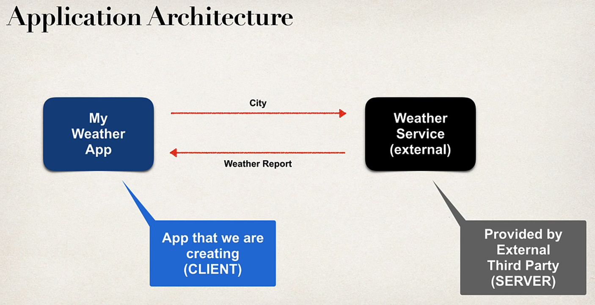
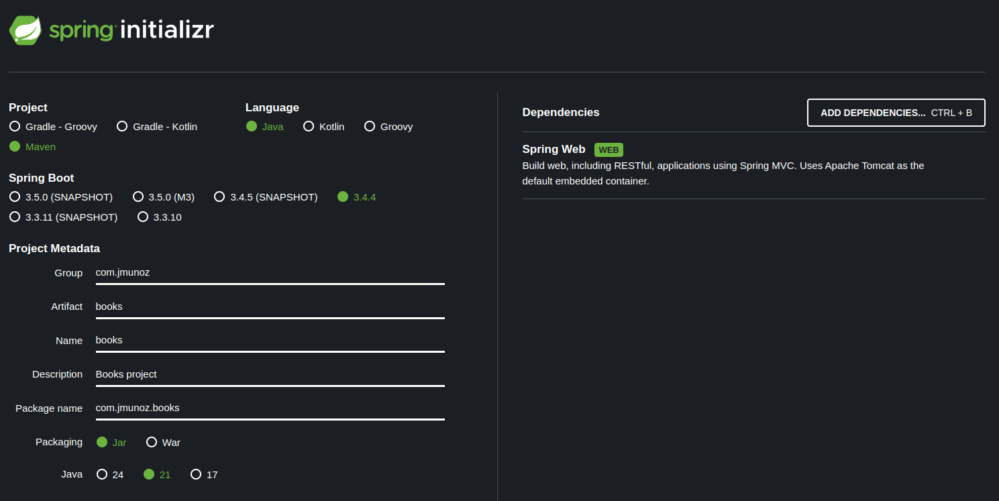
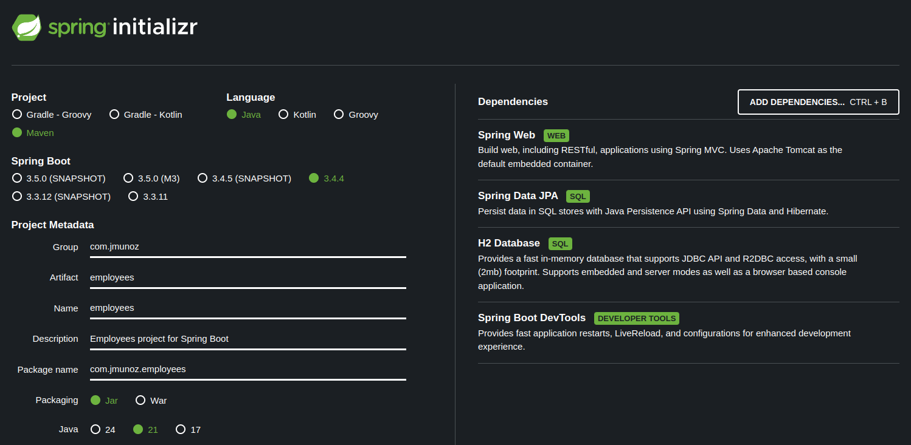
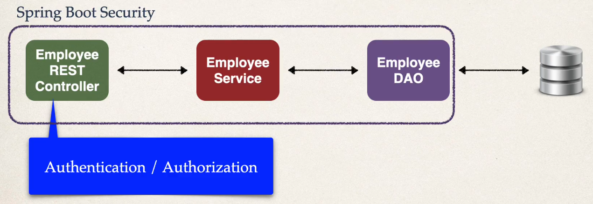
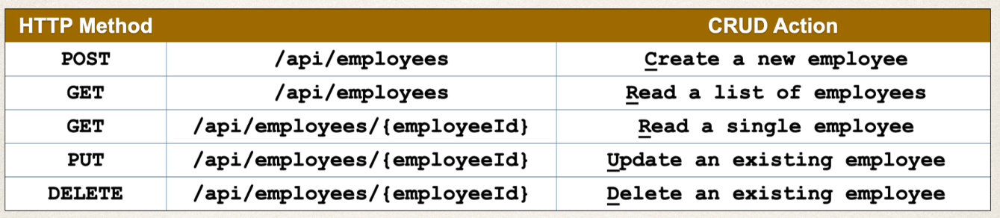

# SPRING BOOT REST APIs: BUILDING MODERN APIs WITH SPRING BOOT

Del curso de UDEMY: `https://www.udemy.com/course/spring-boot-rest-apis`

Lo que aprenderemos será:

- Desarrollo de aplicaciones Spring Boot REST
- Uso de Hibernate/JPa para acceso a BD
- Desarrollo de endpoints REST API usando Spring Boot
- Aplicar Spring Security para controlar el acceso a aplicaciones
- Implementar y hacer uso de JWT construido desde cero
- Añadir Roles y status Admin a través de los endpoints REST
- Uso de configuración Java (no XML) y Maven

## Qué son los servicios REST

Veremos:

- Create REST APIs / Web Services con Spring
- Discutiremos conceptos REST, JSON y mensajería HTTP
- Instalaremos la herramienta de cliente REST: Postman
- Desarrollaremos APIs REST / Servicios Web con @RestController
- Construiremos una interface CRUD a la BD con Spring REST

### Qué problema queremos resolver

Imaginemos que queremos:

- Construir una app de cliente que proporcione el reporte del tiempo de una ciudad
- Necesitamos obtener la data del tiempo de un servicio externo

Nos conectaremos al servicio del tiempo (openweathermap.org) a través de llamadas API REST sobre HTTP.

Las aplicaciones REST pueden usar cualquier formato de datos, siendo lo normal XML y JSON (el más popular y moderno), y son independientes del lenguaje de programación.

## Spring Boot REST - Proyecto 1

Creamos un proyecto llamado `01-books`.

Creamos el proyecto usando Spring Initializr.

Objetivo:

- Aprender lo básico de Spring Boot Rest
- Vamos a usar una lista (no hay BD) con títulos de libros
- Vamos a crear operaciones CRUD, es decir, vamos a crear libros, leer todos o algún título específico, actualizar libros y borrar los libros
- Cada una de estas operaciones CRUD trata con peticiones (requests) y respuestas (responses)
- Vamos a trabajar con Swagger para probar los distintos endpoints de la API

## Spring Boot REST - Proyecto 2

Creamos un proyecto llamado `02-books`, copiando el proyecto anterior.

Básicamente es lo mismo que el proyecto 1, es decir:

- Seguimos enfocados en crear endpoints API Book
- Creamos otro CRUD

Y añadimos:

- En nuestro entity, los campos de id y de rating
- Validaciones de datos
- Manejo de excepciones
- Códigos de estado
- Configuración de Swagger
- Java Request Objects
- Y, en general, añadimos profundidad a la API REST y lo limpiamos de código innecesario

## Spring Boot REST - Proyecto 3

Vamos a cambiar el foco de Books a Employees.

Creamos un proyecto llamado `03-employees`.

La nueva información incluye:

- SQL Databases
- Authentication
- Authorization
- Hashing Passwords

La arquitectura es la siguiente:

Donde Spring Boot Security, que es donde vamos a implementar la autenticación y la autorización, va a securizar el Controller, el Service y el DAO.

El controller será nuestro punto de entrada a la autenticación y autorización, es decir, cuando se llame a un endpoint, Spring Boot Security va a interceptar la llamada y va a verificar si el usuario tiene acceso o no.

Los clientes REST que puedan acceder a la API podrán:

- Obtener una lista de Employees
- Obtener un Employee por id
- Crear un Employee
- Actualizar un Employee
- Borrar un Employee

